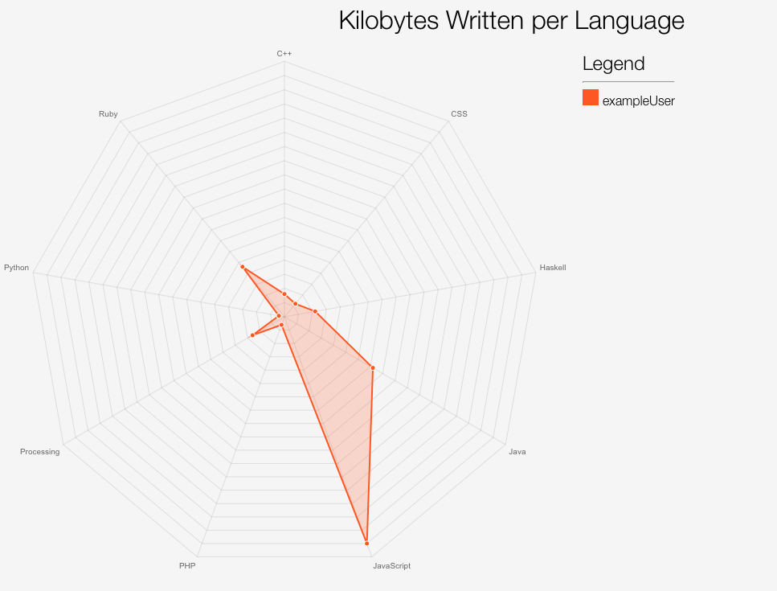
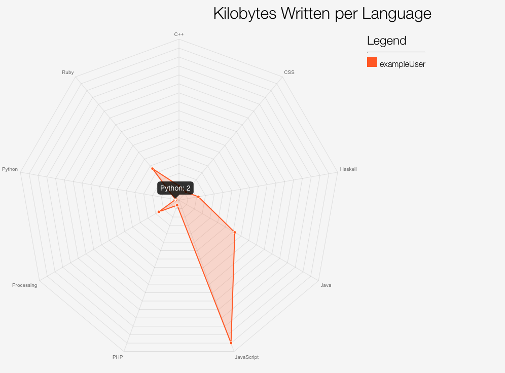
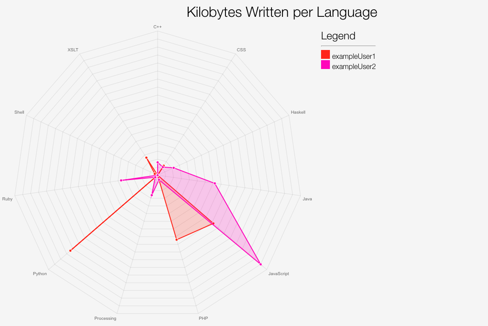
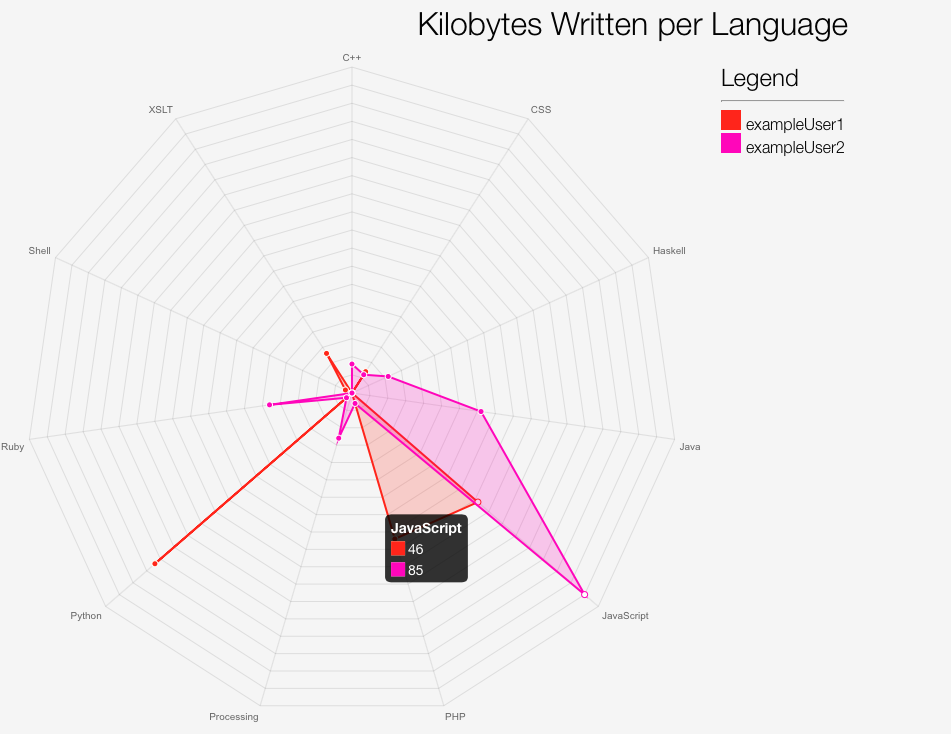
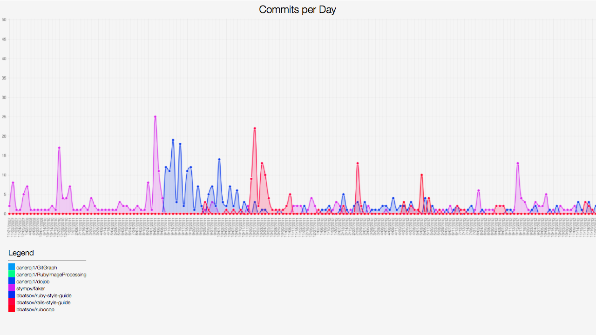

# GitGraph

Displays nice graphs of GitHub usage through a Rack App. Can help you analyze things like what languages you most frequently push in, etc.

## Installation

Add this line to your application's Gemfile:

```ruby
gem 'gitGraph'
```

And then execute:

    $ bundle

Or install it yourself as:

    $ gem install gitGraph

## Usage

### Configuration

You can configure GitGraph with just your GitHub username and password:

```ruby
require 'gitGraph'

# configuring the client
GitGraph::Configuration.config do |config|
  config.username = # your github username
  config.password = # your github password
end

# your GitGraph client is now all configured to access GitHub's apis
client = GitGraph::GitHub::Client.new
```
Or you can setup your client with an access token as well.

```ruby
require 'gitGraph'

# configuring the client
GitGraph::Configuration.config do |config|
  config.username = # your github username
  config.password = # your github password
  config.access_token = # your github access token
end
```
### Comparing Languages

The following code assumes you have an authenticated client.

```ruby
# start adding GitHub users
client << # some github username

client + # another github username

# you can also github users using IDs.
client + 1
client + 537

# you can yield the list of users
client.each { |user, name| puts "#{name}: #{user.inspect}" }

# let's run a language comparison. this checks all of
# the public repositories for each added user and tallies
# up their language usage.
client.compare_languages(:radar) # using a radar chart

# we can change to a bar chart
# the compare languages feature is indexed under
# the :languages key.
client.change_chart_type(:languages, :bar)

# let's render our chart
path = # path to where you want the chart
client.render(path)
```

### Commits per Day

The following code assumes you have an authenticated client.

```ruby
# start adding GitHub repos
client.add_repo('example/repo') # some github username
client.add_repo('example/repo1')

# you can also remove repos
client.remove_repo('example/repo1')

# you can yield the list of repos
client.each_repo { |repo| puts repo }

# let's compare the commits per day for each repo we added
client.commits # the default is a line chart, you can pass options if you want.

# let's render our chart
path = # path to where you want the chart
client.render(path)
```

## Pictures
<h1>Compare Languages Feature</h1>
<p>Example graph with one user.</p>

<br/>

<p>Example graph with one user, with a label.</p>

<br/>

<p>Example graph with two users.</p>

<br/>

<p>Example graph with two users, with a label.</p>

<br/>

<h1>Commits per Day Feature</h1>
<p>I decided to use some real repositories to showcase this.</p>

<br/>

## Contributing

1. Fork it ( https://github.com/[my-github-username]/gitGraph/fork )
2. Create your feature branch (`git checkout -b my-new-feature`)
3. Commit your changes (`git commit -am 'Add some feature'`)
4. Push to the branch (`git push origin my-new-feature`)
5. Create a new Pull Request
